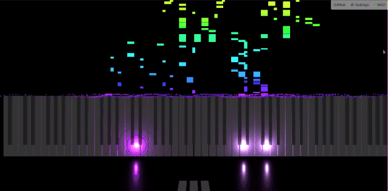

# MIDIocrity

[](https://github.com/cpulvermacher/midiocrity/actions/workflows/node.js.yml)
[](./LICENSE)

Turn any music into lackluster visuals.

Just connect your MIDI controller and open
[https://cpulvermacher.github.io/midiocrity](https://cpulvermacher.github.io/midiocrity)
in your browser.



## Features

- Visualization of MIDI inputs on an 88 key piano, including velocity and pedals.
- Input via PC keyboard (Settings > Show Keys)
- A shabby built-in sythesizer (Turn it off via Settings > Play Sound on MIDI Input, or configure via Settings > Synthesizer)
- MIDI output (Settings > Send MIDI Output)
- Depending on your setup, you can also visualize MIDI files by simply playing them. On Linux, open the app and try running:
```
aplaymidi -p 128:0 hello.mid
```

## Alternatives
- [TonnetzViz](https://cifkao.github.io/tonnetz-viz/) Visualization in a tonal space lattice diagram
- [MIDIVisualizer](https://github.com/kosua20/MIDIVisualizer) A desktop application to visualize MIDI files

## MIDI Protocol References

- https://www.midi.org/specifications-old/item/table-1-summary-of-midi-message
- https://www.midi.org/specifications-old/item/table-3-control-change-messages-data-bytes-2
- https://www.music.mcgill.ca/~ich/classes/mumt306/StandardMIDIfileformat.html 